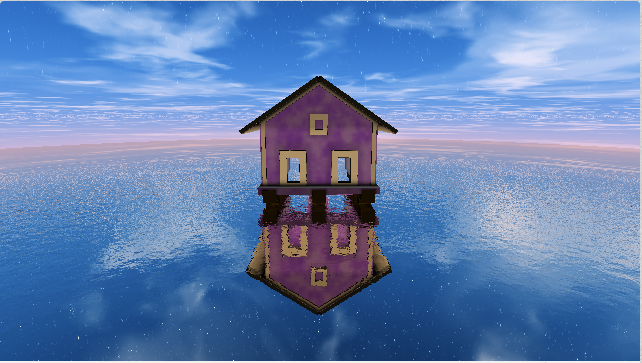

# CIS 566 Homework 3: Environment Setpiece

## Saranya Sampath Submission
Here is the link to my ShaderToy: https://www.shadertoy.com/view/3tGfzw

This is a preview of what it looks like: 

I was inspired by these two pictures to create this scene. I wanted to render a house standing on water with a really pretty starry sky. 

I was inspired by various shadertoys to create this as well. 

I was inspired by this shadertoy to create the sky: https://www.shadertoy.com/view/MlSSR1

I was inspired by these shadertoys to create the reflective water: 

https://www.shadertoy.com/view/MsB3WR

https://www.shadertoy.com/view/wdXfRH

For this environment setpiece homework, I made use of various techinques to create the scene. I used signed distance functions referenced from IQ's website: https://www.iquilezles.org/www/articles/distfunctions/distfunctions.htm

The camera can move based on the user's mouse position, so they can pan it left and right. I also used noise for the stars in the sky as well as the clouds, as well as the rippling of the water. For the sky, I sample from a texture in iChannel0 which creates noise. The color of the purple house also uses noise to create the shadowy look. I also use specular when returning the material colors. I use ray-based specular reflection in the water, SDF blending and operations like subtraction/union while creating the house.

User interaction: at the top of the shader, the user can decide whether or not they want STARS or CLOUDS by commenting in #define statements. They can also change the color of the sky by changing what #define statement for the sky color is uncommented. Color schemes include: 
BLUE, INDIGO, PINK, PURPLE, GREEN, ORANGE, RED

They can also change the type of noise that is applied to create the clouds by changing iChannel0 to whichever noise texture they desire.  
